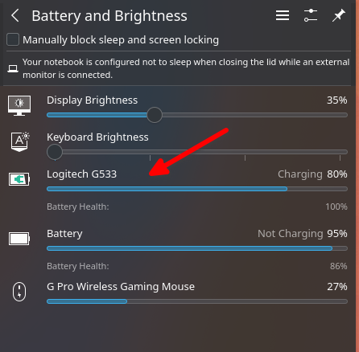

# kde_headsetcontrol_integration

A bad way to integrate a battery indicator for headsets into KDE. 

This was just a quick and easy way for me to get battery information for my headset.

The battery information is fetched using the [HeadsetControl](https://github.com/Sapd/HeadsetControl) tool. 



## Implementation

The implementation consists of a QML C++ plugin that calls the headsetcontrol tool and parses its output. 

The parsed information is then exposed via a property map with keys expected by the KDE BatteryItem QML type. 

After you build and install this module, you can instantiate a new BatteryItem in your KDE code "Battery and Brightness" pop-up dialog(/usr/share/plasma/plasmoids/org.kde.plasma.battery/contents/ui/PopupDialog.qml). In this repo there's also a script that I've been using do apply a patch with these changes: [apply_patch.sh](./kde_files/apply_patch.sh)

```QML
import kde_headsetcontrol_integration 1.0

//...

    BatteryItem {
        Layout.fillWidth: true
        battery: headsetControl.batteryInfo
        remainingTime: dialog.remainingTime
        matchHeightOfSlider: brightnessSlider.slider
        
        HeadsetControl {
            id: headsetControl
        }
    }

//...
```

## Build and installing

Build and install using the typical cmake flow:
```Bash
mkdir build
cd build
cmake ..
make -j 8
sudo make install
```
After installing the plugin, manually modify the PopupDialog.qml file or use the [apply_patch.sh](./kde_files/apply_patch.sh) script and reboot.
